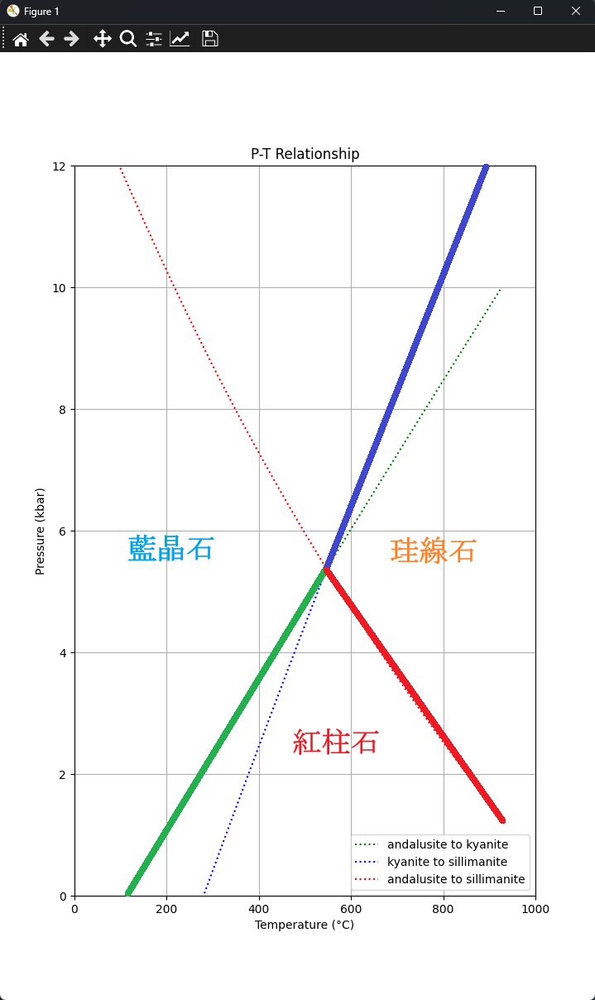

<hr>

## Theme
化学反応式「石英＝コーサイト」が化学平衡となる温度、圧力を求める方法を説明してください。

<hr>

## Formula


<hr>

## Data (standard condition)

|  鉱物  | $\Delta G\;(kJ)$ | $\Delta H\;(kJ)$ | $S\;(exp(10{^-3})kJ.K^{-1})$ | $V\;(kJ.kbar^{-1})$ |   a    |  $b\;(10^{-5})$  |   c    |    d    |
| :--: | :--------------: | :--------------: | :--------------------------: | :-----------------: | :----: | :-----: | :----: | :-----: |
| コース石 |     -850.89      |     -905.52      |            40.80             |        2.064        | 0.0965 | -0.0577 | -444.8 | -0.7982 |
|  石英  |     -856.64      |     -910.88      |            41.50             |        2.269        | 0.1107 | -0.5189 |  0.0   | -1.1283 |
|      |                  |                  |                              |                     |        |         |        |         |

<hr>

## Program

#### needed package 
```cmd
pip install matplotlib sympy
```

#### calculation
```python
import numpy as np
import matplotlib.pyplot as plt
from sympy import symbols, integrate, solve, Eq, nsolve, sqrt

P = symbols('P')
T = symbols('T')

# Cp parameter
aq, bq, cq, dq = 0.0965, -0.0577, -444.8, -0.7982
ac, bc, cc, dc = 0.1107, -0.5189, 0.0, -1.1283
a, b, c, d = aq-ac, (bq-bc)*1e-5, cq-cc, dq-dc 

# ΔH(298,1) and ΔS(298,1)
delta_H_298_1 =  (-905.52) - (-910.88) # J/mol
delta_S_298_1 = (40.80 - 41.50) * 1e-3   # J/mol·K
delta_v_298_1 = 2.064 - 2.269   # kJ/kbar 

exp_delta_Cp = a + b*T + c*T**(-2) + d*T**(-0.5)

expr = (delta_H_298_1 + integrate(exp_delta_Cp , (T,298,T)) + integrate(delta_v_298_1 ,(P,1,P))) - T*((delta_S_298_1) + integrate(exp_delta_Cp/T ,(T,298,T)))

eq = Eq(expr, 0)

# The range ot T
T_values = np.linspace(400, 1000, 600)
P_values = [] 

# solve P by tring T

for t in T_values:
    try:
        P_sol = nsolve(expr.subs(T, t), P, 1.0) 
        P_values.append(float(P_sol)*1e-3)
    except:
        P_values.append(np.nan)  

# plot
plt.figure(figsize=(16, 9))
plt.plot(T_values, P_values, label='P vs T', color='green')
plt.xlim(400, 1000) 
plt.ylim(0, 20) 
plt.yticks(np.arange(0, 21, 5))
plt.xlabel('T (k)')
plt.ylabel('P (kbar)')
plt.title('P-T Relationship')
plt.grid(True)
plt.legend()
plt.show()
```

<hr>

## Result


<hr>

## $Al_{2}SiO_{5}鉱石$


### Data

| 鉱物  | $\Delta G\;(kJ)$ | $\Delta H\;(kJ)$ | $S\;(exp(10{^-3})kJ.K^{-1})$ | $V\;(kJ.kbar^{-1})$ |   a    | $b\;(10^{-5})$ |    c    |    d    |
| :-: | :--------------: | :--------------: | :--------------------------: | :-----------------: | :----: | :------------: | :-----: | :-----: |
| 紅柱石 |     -2440.97     |     -2588.77     |            92.70             |        5.153        | 0.2773 |    -0.6588     | -1914.1 | -2.2656 |
| 藍晶石 |     -2442.59     |     -2593.13     |            83.50             |        4.414        | 0.2794 |    -0.7124     | -2055.6 | -2.2894 |
| 珪線石 |     -2438.93     |     -2585.89     |            95.50             |        4.986        | 0.2802 |    -0.6900     | -1375.7 | -2.3994 |

### Program

```python
import numpy as np
import matplotlib.pyplot as plt
from sympy import symbols, integrate, nsolve

# init variable
P = symbols('P')
T = symbols('T')

class Minecraft:

	# init mineral by gaven data
    def __init__(self, abcd: tuple, h: float, s: float, v: float):
        a, b, c, d = abcd
        self.abcd = (a, b*1e-5, c, d)
        self.h = h
        self.v = v
        self.s = s*1e-3
        self.transtorm = {
            'T_values': [],
            'P_values': []
        }

	# get (∆a, ∆b, ∆c, ∆d)
    def get_delta_abce_transform_to(self, after: 'Minecraft') -> tuple:
        return (
            after.abcd[0] - self.abcd[0],
            after.abcd[1] - self.abcd[1],
            after.abcd[2] - self.abcd[2],
            after.abcd[3] - self.abcd[3]
        )

	# get ∆H
    def get_delta_h_transform_to(self, after: 'Minecraft') -> float:
        return after.h - self.h

	# get ∆S
    def get_delta_s_transform_to(self, after: 'Minecraft') -> float:
        return after.s - self.s

	# get ∆v
    def get_delta_v_transform_to(self, after: 'Minecraft') -> float:
        return after.v - self.v

	# get expression of ∆G
    @classmethod
    def get_expr_of_delta_g(cls, delta_abcd: tuple, delta_h: float, delta_s: float, delta_v: float) -> any:
        a, b, c, d = delta_abcd
        exp_delta_Cp = a + b*T + c*(T**-2) + d*(T**-0.5)
        expr = (delta_h + integrate(exp_delta_Cp , (T,298,T)) + integrate(delta_v ,(P,1,P))) - T*(delta_s + integrate((exp_delta_Cp)/T ,(T,298,T)))
        return expr

	# solve the equation
    @classmethod
    def sub_solve(cls, expr, eqauls, start, stop):
        T_values = np.linspace(start, stop, stop-start)
        P_values = []

        # solve P by trying T
        for t in T_values:
            try:
                P_sol = nsolve(expr.subs(T, t)-eqauls, P, 1.0)  # start at P = 1.0
                P_values.append(float(P_sol))
                print(f't={t},p={P_sol}; ')
            except:
                P_values.append(np.nan)  # append NaN when fails to get solution
        T_values = [x - 273.15 for x in T_values]
        return (T_values, P_values)


# create mineral
andalusite = Minecraft(abcd=(0.2773, -0.6588, -1914.1, -2.2656), h=-2588.77, s=92.70, v=5.153)
kyanite = Minecraft(abcd=(0.2794, -0.7124, -2055.6, -2.2894), h=-2593.13, s=83.50, v=4.414)
sillimanite = Minecraft(abcd=(0.2802, -0.6900, -1375.7, -2.3994), h=-2585.89, s=95.50, v=4.986)

# andalusite to kyanite
expr = Minecraft.get_expr_of_delta_g(
    delta_abcd = andalusite.get_delta_abce_transform_to(kyanite),
    delta_h = andalusite.get_delta_h_transform_to(kyanite),
    delta_s = andalusite.get_delta_s_transform_to(kyanite),
    delta_v = andalusite.get_delta_v_transform_to(kyanite)
)
andalusite.transtorm['T_values'], andalusite.transtorm['P_values'] = Minecraft.sub_solve(expr, eqauls=0, start=200, stop=1200)

# kyanite to sillimanite
expr = Minecraft.get_expr_of_delta_g(
    delta_abcd = kyanite.get_delta_abce_transform_to(sillimanite),
    delta_h = kyanite.get_delta_h_transform_to(sillimanite),
    delta_s = kyanite.get_delta_s_transform_to(sillimanite),
    delta_v = kyanite.get_delta_v_transform_to(sillimanite)
)
kyanite.transtorm['T_values'], kyanite.transtorm['P_values'] = Minecraft.sub_solve(expr, eqauls=0, start=200, stop=1200)

# andalusite to sillimanite
expr = Minecraft.get_expr_of_delta_g(
    delta_abcd = andalusite.get_delta_abce_transform_to(sillimanite),
    delta_h = andalusite.get_delta_h_transform_to(sillimanite),
    delta_s = andalusite.get_delta_s_transform_to(sillimanite),
    delta_v = andalusite.get_delta_v_transform_to(sillimanite)
)
sillimanite.transtorm['T_values'], sillimanite.transtorm['P_values'] = Minecraft.sub_solve(expr, eqauls=0, start=200, stop=1200)


# illustration
plt.figure(figsize=(9, 16))
plt.plot(andalusite.transtorm['T_values'], andalusite.transtorm['P_values'], label='andalusite to kyanite', color='green', linestyle=':')
plt.plot(kyanite.transtorm['T_values'], kyanite.transtorm['P_values'], label='kyanite to sillimanite', color='blue', linestyle=':')
plt.plot(sillimanite.transtorm['T_values'], sillimanite.transtorm['P_values'], label='andalusite to sillimanite', color='red', linestyle=':')
plt.xlim(0, 1000) 
plt.ylim(0, 12) 
plt.yticks(np.arange(0, 13, 2))
plt.xlabel('Temperature (°C)')
plt.ylabel('Pressure (kbar)')
plt.title('P-T Relationship')
plt.grid(True)
plt.legend()
plt.show()


```

### Result:


<hr>
