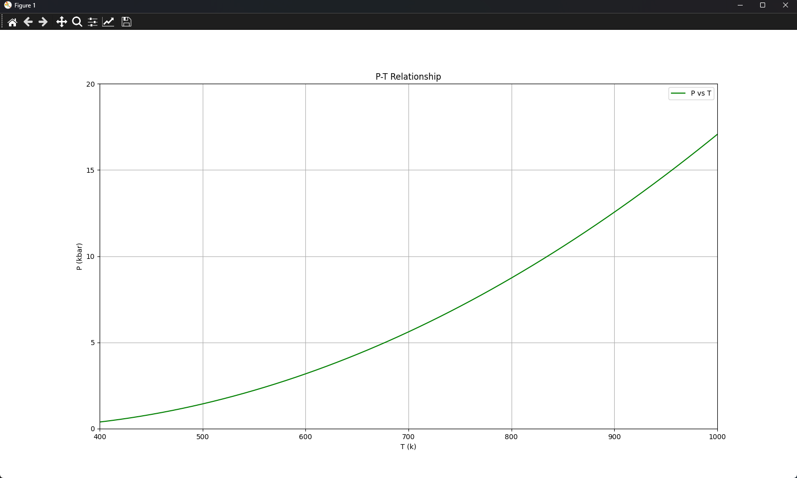

<hr>

## Theme
化学反応式「石英＝コーサイト」が化学平衡となる温度、圧力を求める方法を説明してください。

<hr>

## Formula


<hr>

## Data (standard condition)

|  鉱物  | $\Delta G\;(kJ)$ | $\Delta H\;(kJ)$ | $S\;(exp(10{^-3})kJ.K^{-1})$ | $V\;(kJ.kbar^{-1})$ |   a    |  $b\;(10^{-5})$  |   c    |    d    |
| :--: | :--------------: | :--------------: | :--------------------------: | :-----------------: | :----: | :-----: | :----: | :-----: |
| コース石 |     -850.89      |     -905.52      |            40.80             |        2.064        | 0.0965 | -0.0577 | -444.8 | -0.7982 |
|  石英  |     -856.64      |     -910.88      |            41.50             |        2.269        | 0.1107 | -0.5189 |  0.0   | -1.1283 |
|      |                  |                  |                              |                     |        |         |        |         |

<hr>

## Program

#### needed package 
```cmd
pip install matplotlib sympy
```

#### calculation
```python
import numpy as np
import matplotlib.pyplot as plt
from sympy import symbols, integrate, solve, Eq, nsolve, sqrt

P = symbols('P')
T = symbols('T')

# Cp parameter
aq, bq, cq, dq = 0.0965, -0.0577, -444.8, -0.7982
ac, bc, cc, dc = 0.1107, -0.5189, 0.0, -1.1283
a, b, c, d = aq-ac, (bq-bc)*1e-5, cq-cc, dq-dc 

# ΔH(298,1) and ΔS(298,1)
delta_H_298_1 =  (-905.52) - (-910.88) # J/mol
delta_S_298_1 = (40.80 - 41.50) * 1e-3   # J/mol·K
delta_v_298_1 = 2.064 - 2.269   # kJ/kbar 

exp_delta_Cp = a*T + b*T + c*T**(-2) + d*T**(-0.5)

expr = (delta_H_298_1 + integrate(exp_delta_Cp , (T,298,T)) + integrate(delta_v_298_1 ,(P,1,P))) - T*((delta_S_298_1) + integrate(exp_delta_Cp/T ,(T,298,T)))

eq = Eq(expr, 0)

# The range ot T
T_values = np.linspace(300, 2000, 1700)
P_values = [] 

# solve P by tring T

for t in T_values:
    try:
        P_sol = nsolve(expr.subs(T, t), P, 1.0) 
        P_values.append(float(P_sol)*1e-3)
    except:
        P_values.append(np.nan)  

# plot
plt.figure(figsize=(16, 9))
plt.plot(T_values, P_values, label='P vs T', color='green')
plt.xlim(500, 2000) 
plt.ylim(0, 80) 
plt.yticks(np.arange(0, 81, 5))
plt.xlabel('T (k)')
plt.ylabel('P (kbar)')
plt.title('P-T Relationship')
plt.grid(True)
plt.legend()
plt.show()
```

<hr>

## Result



<hr>